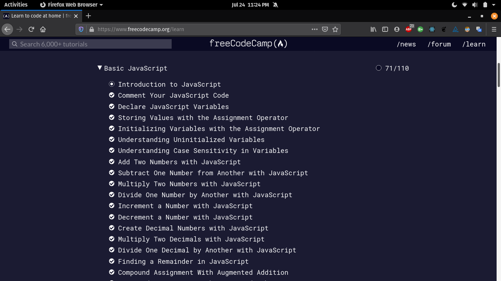
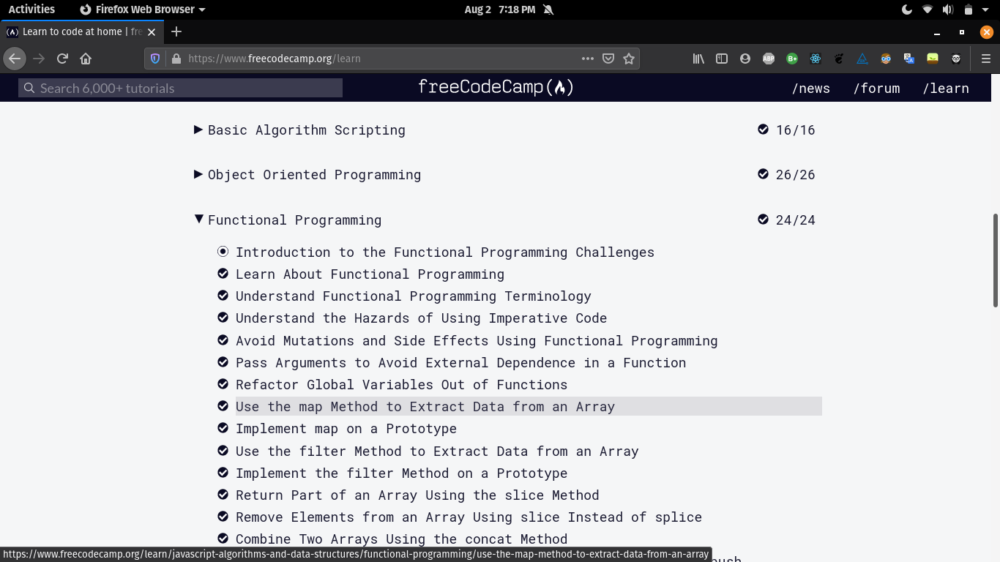
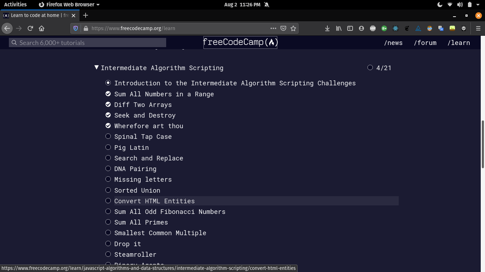
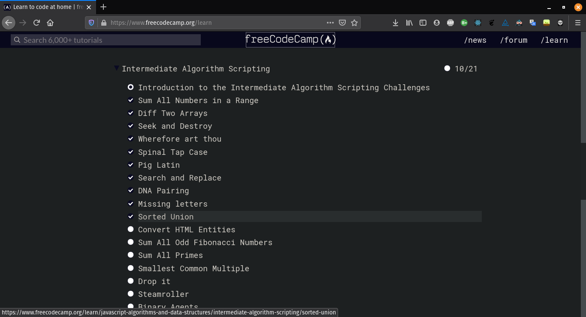
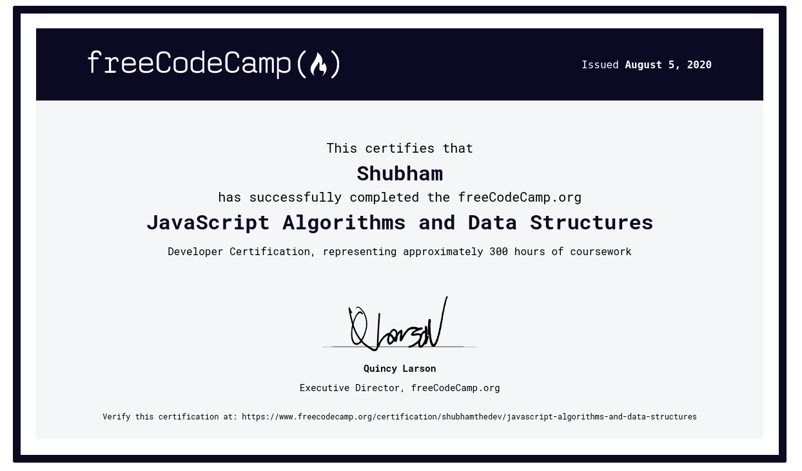
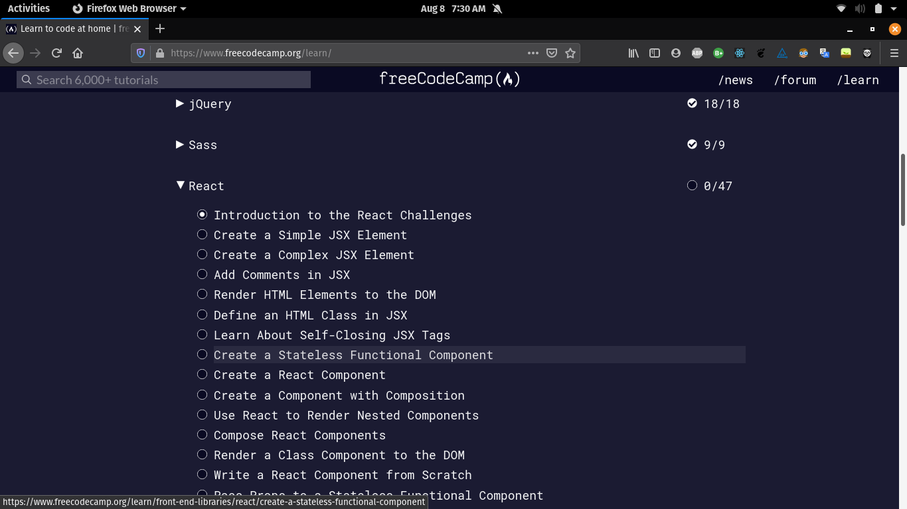

## R1 D1

- Today I'll try my best to complete the stuff that i already know over on freecodecamp like responsive design, accessibility etc. and try my best to do most of the front end stuff but it's probably gonna take longer than a day so yeah I'm gonna commit.

- Okay so yesterday i managed to finish the topics from Applied Visual Design to CSS Grids which tbh i could have done more since i already know these things but oh well.

## R1 D2

- Okay so today I'm going to try to finish the JS section if possible but I'm hoping to do so plus I have projects to complete in the responsive design section.

- Alright so managed to finish responsive web design section and started with the basic JavaScript, wasn't able to finish the JS section entirely because i underestimated the amount of work required.

 

## R1 D3

- Alright so today's goal is to complete JS section but as always it might be too much still, so I'm gonna try my best.

- Okay so i did manage to finish the basics of JS section over on freecodecamp, a bit dissappointed with it since i got stuck on things that i have done before but oh well at least i got a refresher on it.

## R1 D4

- Alright so onto day 4, I am feeling great today so hoping to complete the ES6 and regex sections today.

- Didn't do much yesterday being that it was a Sunday but still did some ES6

## R1 D5

- Going to begin with ES6 gonna continue towards getting that certificate, it has taken me a long time for some reason but i gonna try over and over again

- Okay so i finished up till the regular expressions and in between started the basic algorithms section which was fun but i still need to finish debugging and basic data structures.

## R1 D6

- Gonna start by completing the debugging section and then basic data structures plus since i already did 10/16 questions from basic algorithms section I'm gonna complete those first if possible.

- Hurray! I managed to hit my goal and completed 3 sections debugging, basic data structures and basic algorithm scripting.

## R1D7

- Onto Day 7 today I plan on finishing object oriented programming and functional programming sections.

- Next I'm gonna work on a react based project to brush up my skills.

- Okay so i did work on a react project and i finished the object oriented programming section on this day but i spent a lot of time on that react app so i wasn't able to complete functional programming section.

## R1D8

- Gonna still work my way up the curriculum on freecodecamp and finish the JS section plus I'll still work on my React App.

- I did progress in my app a lot but i didn't progress much in the JS section, gotta work on focusing on a single thing at a time.

## R1D9

- Gonna finish the app first today, it just needs one more route and dark mode functionality, then I'll continue with functional programming.

- Finished the project

## R1D10

- Finished the functional programming section

## R1D11

- Started with the intermediate algorithms section couldn't do much on this day but still managed a few.

## R1D12

- Okay today i have to finish the intermediate algorithms section and maybe even begin with the algorithms project section as well let's see how this goes.

- I did manage to finish 10/21 questions but still have 11 more to go.

## R1D13

- Gonna finish the rest of the section today hopefully, gonna practice some meditation too today to help me get more focus.

- Finished the intermediate section.

## R1D14

- Finished the javascript algorithms and data structures certifications

## R1D15

- Next up gotta complete a page that I've been working on to get an internship, continuing with the freecodecamp curriculum i need to complete sass and react.

- I completed the task for the internship let's see if I fail or get the internship, I didn't begin with any new freecodecamp stuff on this day.

## R1D16

- Beginning with the freecodecamp stuff today, I'm moving forward with the sass section and let's see how far i could go, also I'm taking a data structures course on freecodecamps youtube channel.

- Completed the sass section and watched 35 mins worth of data structures.

## R1D17

- Gonna watch more data structures on freecodecamp's youtube channel, plus plan ahead for how i wanna approach companies next.

- Start with the React section.
